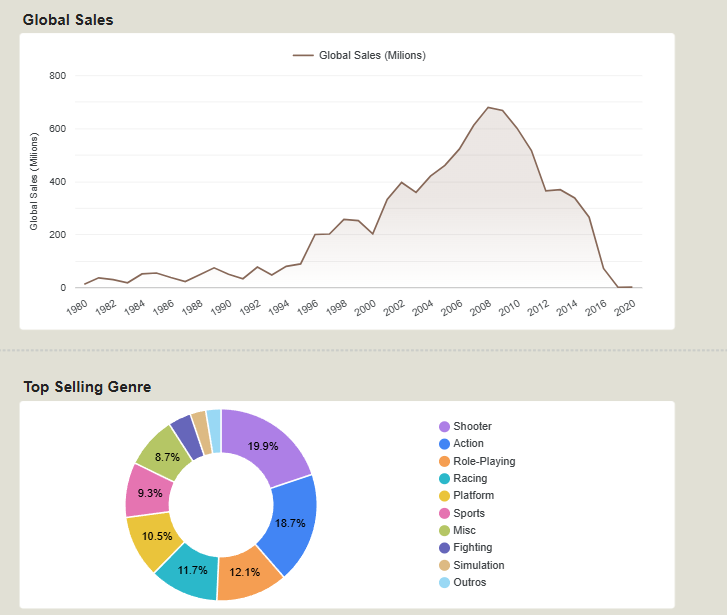

# 🎮 Video Games Sales Data Pipeline 
[](https://cloud.google.com/)
[](https://www.terraform.io/)
[](https://www.docker.com/)
[](https://airflow.apache.org/)
[](https://www.getdbt.com/)
[](https://cloud.google.com/bigquery)
[](https://lookerstudio.google.com/)

> Final project developed for the [Data Engineering Zoomcamp](https://github.com/DataTalksClub/data-engineering-zoomcamp) by DataTalks.Club.
> 
> 🇧🇷 *[Versão em Português disponível aqui](./README-pt.md)*

---

## ✅ Peer Review Evaluation Criteria
This project meets all the requirements for the Data Engineering Zoomcamp final project:

- [x] **Problem Description:** Clearly stated below.
- [x] **Cloud:** Developed entirely on Google Cloud Platform (GCP) with Infrastructure as Code (Terraform).
- [x] **Data Ingestion (Batch):** Automated end-to-end pipeline using Apache Airflow (Dockerized) to extract data from Kaggle to a Data Lake (GCS).
- [x] **Data Warehouse:** BigQuery tables optimized with **Partitioning** (by year) and **Clustering** (by platform).
- [x] **Transformations:** `dbt` used for data cleaning, type casting, and aggregations (Silver and Gold layers).
- [x] **Dashboard:** Looker Studio dashboard with interactive filters answering business questions.
- [x] **Reproducibility:** Detailed, step-by-step instructions provided below.

---

## 📌 Table of Contents
* [About the Project](#-about-the-project)
* [Architecture & Technologies](#-architecture--technologies)
* [Data Warehouse Optimizations](#-data-warehouse-optimizations)
* [Analytics Dashboard](#-analytics-dashboard)
* [Repository Structure](#-repository-structure)
* [How to Reproduce](#-how-to-reproduce)

---

## 🎯 About the Project

The video game industry generates billions annually. For publishers and developers, understanding sales trends by region, genre, and platform is vital for directing new projects.

This project builds an **End-to-End Data Pipeline** that extracts global video game sales history, loads and processes this information in the cloud (GCP), and makes it available in an optimized Data Warehouse for an analytics dashboard.

**Data Source:** [Video Game Sales Dataset (Kaggle)](https://www.kaggle.com/datasets/gregorut/videogamesales)

---

## 🏗️ Architecture & Technologies

The pipeline was designed using modern Data Engineering concepts:

1. **Infrastructure as Code (IaC):** `Terraform` to provision the Data Lake and Data Warehouse on Google Cloud.
2. **Orchestration:** `Apache Airflow` running in `Docker` containers for data ingestion.
3. **Data Lake:** `Google Cloud Storage (GCS)`.
4. **Data Warehouse:** `Google BigQuery`.
5. **Transformation (ELT):** `dbt (Data Build Tool)` for data standardization, cleaning, and aggregation (Staging and Marts layers).
6. **Data Visualization:** `Google Looker Studio`.

---

## ⚙️ Data Warehouse Optimizations

To ensure scalability, query performance, and cost reduction in BigQuery, the final analytics table (`marts_platform_yearly_sales`) was optimized using the following modeling strategies natively implemented via **dbt**:

* **Partitioning:** By Release Year (`release_year` cast to `INT64`). Reduces the volume of data scanned in temporal queries.
* **Clustering:** By Platform/Console (`platform`). Physically sorts the data within partitions for ultra-fast searches by console.

---

## 📊 Analytics Dashboard

The final product of this pipeline is an interactive dashboard built in Looker Studio, designed to answer business questions such as total global sales volume, historical industry evolution, and top platforms/genres.

🔗 **[Access the Live Interactive Dashboard here!](https://lookerstudio.google.com/reporting/67972fad-2a3b-4b47-b08c-64c265923d8d)**



---

## 📁 Repository Structure

```
DE-zoomcamp-project/
├── dbt/                    # SQL models, macros, and dbt configurations
│   └── video_games_transform/
├── orchestration/          # Airflow configs, DAGs, and Docker Compose
│   ├── dags/
│   └── credentials/        # GCP Service Account folder
├── terraform/              # IaC files (.tf) to provision GCS and BigQuery
├── .gitignore              # Files to be ignored by Git
├── README.md               # Project documentation
└── requirements.txt        # Local Python dependencies
```

## 🚀 How to Reproduce

Follow the steps below to recreate this infrastructure in your own environment.

### Prerequisites
* Active Google Cloud Platform (GCP) account and a created Project.
* [Terraform installed.](https://developer.hashicorp.com/terraform/install).
* [Docker](https://docs.docker.com/get-started/get-docker/) and Docker Compose installed..
* Kaggle API credentials (```kaggle.json```)

# 1. Repository and Credentials Setup
Clone the repository to your local machine:
```
git clone [https://github.com/GPetrolini/DE-zoomcamp-project.git](https://github.com/GPetrolini/DE-zoomcamp-project.git)
cd DE-zoomcamp-project
```
## GCP Credentials:

### 1. Create a Service Account in GCP with Storage Admin and BigQuery Admin roles..

### 2.Generate the JSON key and save it as ```google_credentials.json``` inside the ```orchestration/credentials/```.

## Environment Variables (.env):

Create a ```.env``` file inside the ```orchestration/``` folder and configure your Kaggle and GCP variables (replace example values):

```
# orchestration/.env
KAGGLE_USERNAME=your_kaggle_username
KAGGLE_KEY=your_kaggle_secret_key
GCP_PROJECT_ID=de-zoomcamp-12345
GCP_GCS_BUCKET=your_unique_bucket_name
```
# 2. Infrastructure Provisioning (Terraform)
Navigate to the Terraform folder to create the Bucket (GCS) and Dataset (BigQuery):

```
cd terraform
terraform init
terraform plan
terraform apply
```

# 3. Data Ingestion Orchestration (Airflow)
Start the Airflow containers and trigger the ingestion pipeline:

```
cd ../orchestration
docker-compose up -d
```
* Access the Airflow UI at ```http://localhost:8080```
* Enable and trigger the DAG responsible for fetching Kaggle data and sending it to GCS/BigQuery.

# 4. Data Transformation (dbt)
With the raw data in BigQuery, create a Python virtual environment, install local dependencies, and run dbt transformations:
```
cd ../
python -m venv .venv
source .venv/bin/activate  # ou .venv\Scripts\activate no Windows
pip install -r requirements.txt

cd dbt/video_games_transform
dbt deps
dbt run --full-refresh
```
After ```dbt run```, your Silver (Staging) and Gold (Marts) layer tables will be partitioned, clustered, and ready for Looker Studio in your BigQuery!